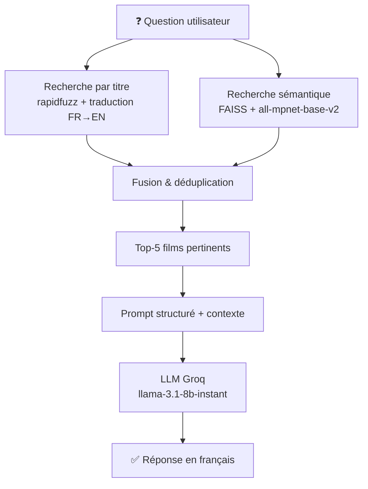
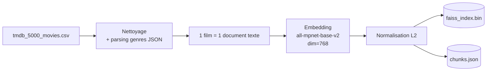

# Project_RAG_movie_recommender


Un système de recommandation de films basé sur l'architecture RAG (Retrieval-Augmented Generation), construit de zéro avec Python, FAISS et Groq — sans LangChain ni LlamaIndex.


---

##  Présentation

Ce projet implémente un assistant conversationnel capable de :

- Donner le **synopsis** d'un film (en français, même si le titre est en anglais)
- Faire des **recommandations** basées sur un thème, un genre ou une description
- Trouver un film à partir d'une **description vague** sans connaître le titre
- Répondre aux questions sur les films du dataset **TMDB 5000**

Le système combine une **recherche sémantique vectorielle** (FAISS) et une **recherche par titre** (fuzzy matching avec rapidfuzz) pour maximiser la pertinence des résultats.

---

##  Architecture



### Phase 1 : Indexation



### Phase 2 — Interrogation


---

## 📁 Structure du Projet

```
rag-movie-recommender/
│
├── data/
│   └── tmdb_5000_movies.csv       # Dataset TMDB 5000 (Kaggle)
│
├── embeddings/
│   ├── faiss_index.bin            # Index vectoriel persisté
│   └── chunks.json                # Documents + métadonnées (4803 films)
│
├── src/
│   ├── __init__.py
│   ├── config.py
│   ├── chunking.py
│   ├── embedding.py
│   ├── retriever.py
│   └── generator.py
│
├── indexation.py                  # Script d'indexation (à lancer une fois)
├── rag.py                         # Interface en ligne de commande
├── app.py                         # Interface Streamlit
│
├── requirements.txt
├── .env                           # Clé API (non commitée)
├── .gitignore
└── README.md
```

---


## 💬 Exemples de Requêtes

| Type | Exemple |
|------|---------|
| Synopsis | `donne moi le synopsis de Inception` |
| Titre français | `synopsis de la matrice` |
| Faute de frappe | `harry poter` |
| Description | `film sur des explorateurs qui traversent un trou de ver` |
| Thème | `meilleurs films sur l'intelligence artificielle` |
| Similaires | `des films similaires à Harry Potter` |
| Opinion | `que penses-tu du film Titanic ?` |

---

## 🔧 Choix Techniques

### Pourquoi 1 film = 1 document 

La version initiale utilisait un chunking par caractères (taille 500, overlap 50). Cela produisait des chunks tronqués au milieu des synopses, dégradant la qualité des embeddings. Les synopses TMDB étant courts (200-400 caractères), un document complet par film est plus cohérent sémantiquement.

### Pourquoi une recherche hybride ?

La recherche sémantique seule échoue sur les requêtes directes par titre (`"synopsis de Matrix"`). La recherche par titre seule échoue sur les descriptions (`"film sur l'IA"`). La combinaison des deux couvre tous les cas d'usage.

### Pourquoi rapidfuzz ?

Pour tolérer les fautes de frappe (`"harry poter"` → `"Harry Potter"`) et les titres partiels, sans recourir à un matching exact qui échouerait sur la plupart des requêtes naturelles.

### Pourquoi `faiss.normalize_L2` ?

FAISS IndexFlatL2 calcule la distance euclidienne L2. En normalisant les vecteurs, la distance L2 devient équivalente à la similarité cosinus, qui est la métrique standard pour les embeddings sémantiques.

---

## 📦 Dépendances

| Package | Usage |
|---------|-------|
| `groq` | Client API LLM (llama-3.1-8b-instant) |
| `sentence-transformers` | Modèle d'embedding all-mpnet-base-v2 |
| `faiss-cpu` | Base vectorielle locale |
| `rapidfuzz` | Fuzzy matching pour la recherche par titre |
| `streamlit` | Interface web |
| `pandas` | Chargement et manipulation du CSV |
| `python-dotenv` | Gestion des variables d'environnement |
| `tqdm` | Barres de progression lors de l'indexation |

---
